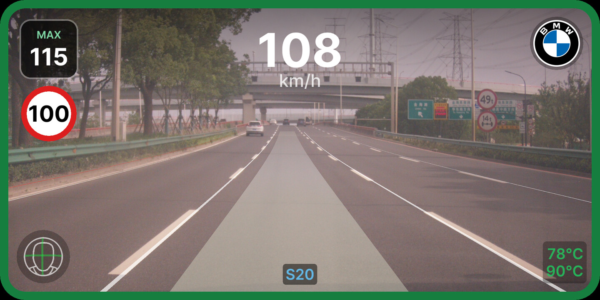
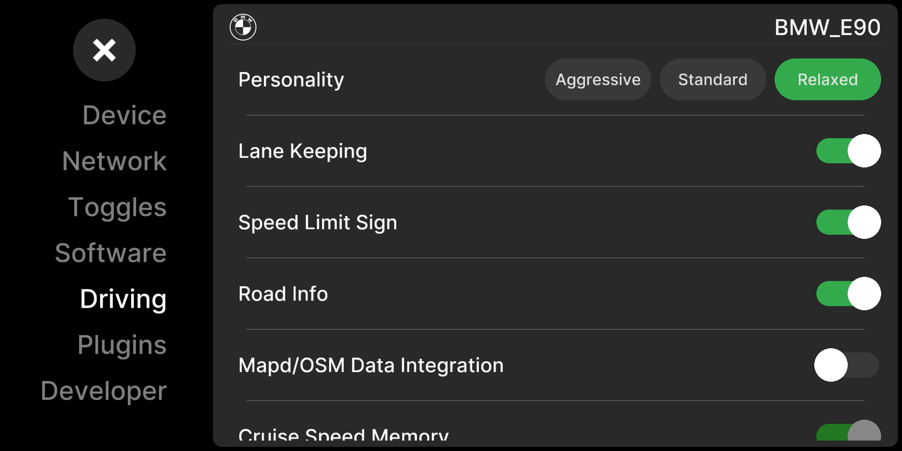

# BMW E9x / E8x

Unofficial support of openpilot on BMW E8x and E9x platforms.

Built on the community port by **dzid** and the
[BMW-E8x-E9x openpilot project](https://github.com/BMW-E8x-E9x/openpilot/wiki),
which worked out the StepperServoCAN steering actuator and the cruise-stalk
emulation this plugin drives.

 

## Hardware retrofit

The car needs CAN bus wiring and an external steering actuator based on
StepperServoCAN. Please read the
[project wiki](https://github.com/BMW-E8x-E9x/openpilot/wiki) for details.

## Improvements

**Curvature-based lateral control.** The stock torque control is replaced by a
controller that works in curvature, computing the torque needed to move the
wheels by the remaining curvature error. The result is far steadier tracking on
the hydraulic rack and StepperServoCAN actuator.
[LATERAL_CONTROLLER.md](LATERAL_CONTROLLER.md) is the full design.

**Fine-tuned DCC cruise control.** Longitudinal control on a DCC car works by
emulating cruise-stalk presses. The plugin owns the stalk message properly and
shapes set-speed changes to openpilot's target, so slowing for lead cars and
curves is smooth rather than steppy.

**VIN-based fingerprinting.** The plugin reads
the model code and variants straight from the VIN. Detection is deterministic.

## Supported cars

| Platform | Cars it covers |
|---|---|
| BMW E8x | 1-Series coupe / convertible (E82 / E88), 2004–13 |
| BMW E9x | 3-Series sedan / wagon / coupe / convertible (E90 / E91 / E92 / E93), 2005–11 |

## Settings

**Settings → Plugins → "BMW E9x/E8x Car Interface"** is the master switch.
With it on, BMW is a recognized car and openpilot fingerprints the vehicle at
startup; with it off, BMW isn't in the system at all.

When a BMW is detected, the vehicle section of **Settings → Driving** adds:

- **Temperature Overlay** — coolant and oil temperature at the bottom right of
  the driving screen, colored blue through red from cold to critical. On by
  default.
- **Resume Button Repurposed** — On this car the
  cruise stalk's resume button does double duty: a short press resumes cruise
  when disengaged, or confirms/cancels a detected speed limit when engaged; a
  long press cycles the driving Personality.

- **Cruise Speed Memory** — re-engaging cruise within a drive restores the
  set-speed ceiling you last dialed in, instead of resetting to openpilot's
  default (40 km/h, or 105 km/h in experimental mode).

## Status and limits

This is a community port of an unsupported car. Treat it accordingly.

- **DCC is the tested cruise path.** Normal cruise control (NCC) and the
  ACC-module variants are recognized but much less exercised.
- **Tuned on an E90.** The E82 shares the software but has seen far less road
  time.
- **No cruise below 30 km/h**, per the car.

## More

Architecture, the DCC cruise-stalk machinery, fingerprinting, hooks, params
and telemetry are in [DESIGN.md](DESIGN.md). The lateral controller has its
own deep-dive in [LATERAL_CONTROLLER.md](LATERAL_CONTROLLER.md).
