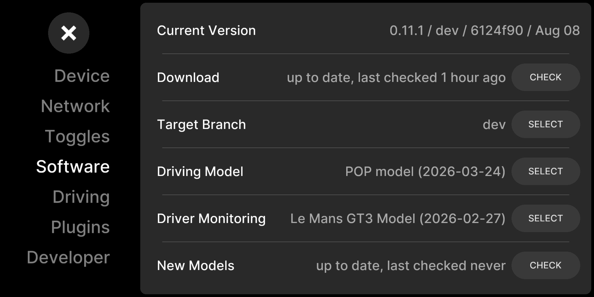

# Model Selector

Browse, download, and switch between openpilot driving and driver-monitoring
models.

## What it does

openpilot ships with one driving model and one driver-monitoring (DM) model.
This plugin lets you keep several of each on the device and pick which one is
active:

- **Driving model** — the neural net that actually steers and paces the car
  (lateral and longitudinal). Swapping it is the one that changes how the car
  drives.
- **Driver-monitoring model** — swapping it changes how driver monitoring behaves.

It can also reach out to the [openpilot](https://github.com/commaai/openpilot)
GitHub repo, find newer models that comma has published, and download them for
you.

## How to use it

Everything lives in **Settings → Software**. The plugin adds three rows:

- **Driving Model** — shows the active driving model; tap **SELECT** to see
  every driving model installed on the device and switch, or delete one you no
  longer want.
- **Driver Monitoring** — same, for the DM model.
- **New Models** — tap **CHECK**. It asks GitHub what comma has published
  since, lists anything newer than what you have, and lets you download it.
  The row shows status (`checking…`, `N available`, `downloading`,
  `download complete`, `up to date`).

When you activate a model, the plugin stages it and asks you to **Reboot** —
the swap only takes effect after the reboot. If you cancel the reboot prompt,
it puts the previous model back, so nothing changes until you actually reboot.

## Things to know

- **A driving-model swap changes how the car drives.** Treat a new driving
  model like any other tuning change: try it somewhere safe first.
- **It takes effect after a reboot**, not live while driving.
- **First drive after a swap is slow to start.** The first time a given model
  runs on this device, openpilot has to compile it for the hardware (roughly a
  minute on a comma three). After that it's cached — switching back to a model
  you've used before is instant.
- **You can't delete the model that's currently active.** Switch to another
  one first.
- **Old models are hidden.** Models too old to work with this openpilot
  version are filtered out of the lists automatically, so you can't
  accidentally install one that won't run.

## Turning it on and off

It's a standard plugin: enable or disable it under **Settings → Plugins**.
With it off, the extra rows in the Software panel simply don't appear and the
active model is whatever was last selected.

## More

Where models are stored, how downloads and the ONNX→PKL cache work, and the
hooks it uses are in [DESIGN.md](DESIGN.md).
