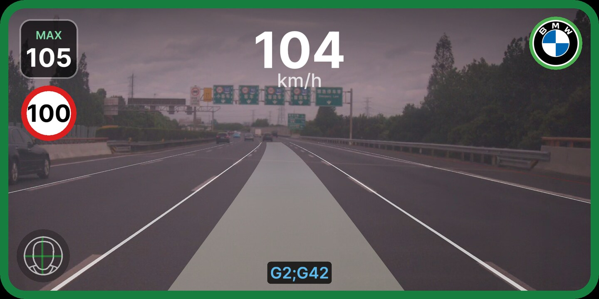
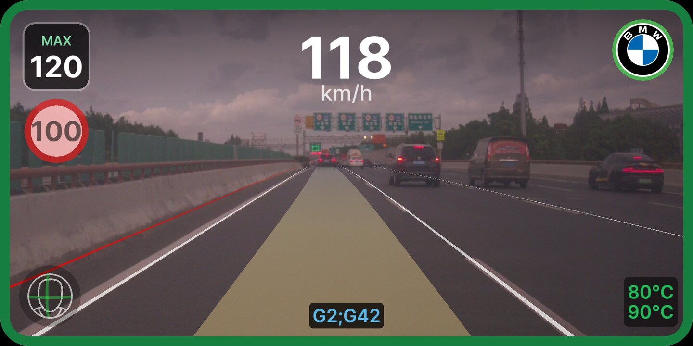

# Speed Limit Daemon

Watches the speed limit and slows the car for sharp curves and highway
ramps — without ever speeding you up.

## What it does

speedlimitd keeps a running estimate of the speed limit on the road you're on
and, when you let it, caps openpilot's cruise speed to it. It draws that limit
on the driving screen as a round speed-limit sign.

It works out the limit from what it can see and what it knows about the road:

- **The map.** Pre-downloaded offline map tiles tell it the road's identity —
  its name, and whether it's a numbered expressway (a "G" national or "S"
  provincial route). On expressways it raises the limit accordingly (100 or
  120 km/h). By default it does **not** trust the map's posted speed numbers or
  road geometry for ordinary roads — in China those are too often wrong or
  ambiguous where roads stack on top of each other — so it reads the road
  itself with the camera instead. An optional toggle (see below) lets it use
  the map's posted numbers directly, where they're reliable.
- **The camera.** It counts how many lanes the road has from the driving model
  and turns that into a sensible limit: a wide multi-lane road gets a higher
  limit than a narrow two-lane street or an on/off ramp.
- **Curves.** It looks ahead at how sharp the road bends and works out a
  comfortable speed for the curve, then starts easing the cap down *before* you
  reach it so the slowdown is gradual, not a last-second lurch. A second,
  faster safeguard reacts to how hard the car is actually cornering and tightens
  the cap if a curve turns out sharper than it looked.

Whatever these sources suggest, the car always obeys the **lowest** of them.

## What it will and won't do

- It only ever **slows the car or holds it** — it never accelerates on its own.
  If the limit rises, you speed back up yourself.
- **The gas pedal always wins.** Press the accelerator and enforcement is
  suspended for as long as you're on the pedal; when you lift off, it holds
  your new speed rather than yanking you back down.
- When it's enforcing, the deceleration is shaped to be comfortable — it leans
  on the same smooth braking the car already uses for cruise.

## Turning it on and off

Enable or disable the whole plugin from **Settings → Plugins**.

Two things you control while driving:

- **Confirm / cancel the limit.** Tap the speed-limit sign on the driving
  screen to toggle enforcement. The sign is shown at **half brightness** when
  it's only a suggestion and at **full brightness** when it's actively capping
  your cruise speed. It starts confirmed (active) as soon as you go onroad.

| Enforcing | Suggestion only |
|-----------|-----------------|
|  |  |
| Sign at full brightness. The 100 limit is confirmed, so MAX drops to 105 and the car is held there. | Sign dimmed. The same 100 limit is known but not enforced, so MAX stays at your own 120. |
- **Show or hide the sign.** *Show Speed Limit Sign* in the plugin's settings
  turns the on-screen sign on or off (enforcement is unaffected).

## Using OpenStreetMap's posted speed limits (optional)

*Mapd/OSM Data Integration*, in the plugin's settings, lets speedlimitd use
the actual posted speed limit from the offline map data instead of guessing
it from lane count and road type.

- **When it's on and the map has a fresh, plausible limit for the road you're
  on**, that number becomes the limit — the camera-based lane-count guess
  steps aside. The camera's curve and cornering caps still apply on top, and
  the car always obeys whichever number is lowest, exactly as above.
- **When it's off, or the map has nothing usable** — no tiles downloaded, no
  limit tagged on that road, GPS not locked, or the reading has gone stale —
  it falls straight back to reading the road with the camera, the same as
  before this feature existed.
- **Default: off in China, on everywhere else.** This is set automatically
  the first time the car ever gets a GPS fix, based on where you are — in
  China the map's posted numbers are often wrong or missing, but they're
  reliable in most other places. After that first fix it's entirely up to
  you: flip it either way in the plugin's settings and it stays that way.
- **Map tiles come from Connect.** This only works where you've downloaded
  offline map tiles for your area through the Connect app. If the toggle is
  on but there's no tile data for where you're driving, the Driving settings
  panel shows a yellow warning under the toggle: *"No offline map tiles for
  your area — download them in Connect."* Download the tiles in Connect and
  the warning clears.
- **Turning it off restores exactly the previous behavior** — nothing else
  about how speedlimitd works changes.

## Honest limits

- **It's an assist, not a chauffeur.** It's a cap and a suggestion. You are
  still driving and still responsible for the speed you travel at.
- **No high-definition map.** It has no lane-level HD map and no radar/lidar
  road model. Everything comes from offline tiles plus the camera.
- **The camera can be fooled.** On some roads — especially where a parallel
  carriageway runs alongside yours, or in construction zones — the model can
  miscount lanes for a few seconds and briefly show the wrong limit (too low,
  occasionally too high). When it reads low, the gas pedal overrides it; the
  design deliberately errs toward the cautious (lower) number.
- It's tuned for and geo-detects **China, Germany, and Australia**; elsewhere
  it falls back to a conservative default.

## More

The source-fusion logic, exact thresholds, the curve and cornering caps, the
lane-count rules, telemetry, and every tuning parameter are in
[DESIGN.md](DESIGN.md).
