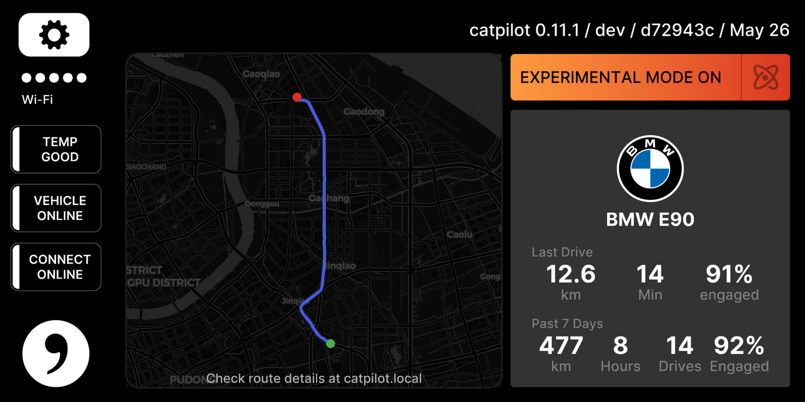

# UI Customizations (ui_mod)

The catpilot look-and-feel: a branded home screen, the car emblem on the
driving screen, and the extra Settings panels. 

## What you see

### Home screen (offroad)

- **Left**: a map of your **last drive** — the GPS trace on a dark map, a
  green dot where you started and a red dot where you stopped, auto-zoomed to
  fit the whole route.
- **Right**: your car's **emblem and model name**, your **last drive**
  (distance, time, % engaged) and a **past-7-days** summary (distance, hours,
  drives, % engaged). The weekly numbers come from the connect-on-device
  service; the last-drive numbers are measured on the car itself.
- A small **update dot** appears when plugin updates are available.

### Driving screen (onroad)

Above: the colour emblem (experimental mode) with no green ring — lane keeping
is standing by — and the road ref **S20** along the bottom.

- The stock steering-wheel / experimental-mode button is replaced by your
  **car's brand emblem**. Tap it to toggle experimental mode, exactly like the
  stock button (only on cars where that's allowed).
  - White emblem = normal (chill) mode.
  - Color emblem = experimental mode.
  - A **green ring** around the emblem means **Lane Keeping is actively
    holding the lane** (the `lane_keeping` plugin is anchored). The ring goes
    dark when lane keeping releases — worn paint, a lane change — and comes
    back on its own.
- If enabled, the current **road name / highway ref** shows at the bottom of
  the screen (read from the speed-limit plugin).

### Settings

ui_mod adds two panels to Settings:

- **Driving** — everything about how the car drives: personality
  (aggressive / standard / relaxed) plus a toggle for each installed driving
  plugin (Lane Keeping, Lane Centering, Speed Limit Sign, Road Info, Look
  Ahead Steering, …). When a car is recognized, that car's **own settings**
  (e.g. BMW lane-change and steering options) appear in this same list, under
  the car's emblem and fingerprint.
- **Plugins** — turn whole plugins on and off, and check for / install plugin
  updates. Some core plugins are locked on and can't be toggled.

The Driving panel is the default panel Settings opens to.

*The Driving panel on a recognized BMW — the car's emblem and fingerprint sit
above the per-plugin toggles.*

## Supported devices

ui_mod only loads on the **comma 3 (`tici`) and comma 3X (`tizi`)** — the
manifest's `device_filter` excludes other devices. On a comma 4 (`mici`) the
plugin is skipped entirely and you get the stock UI. This is a testing
limitation, not a technical one: we have no comma 4 hardware to verify the UI
on. Once one is available, support is enabled by adding `"mici"` to
`device_filter` in `plugin.json`.

## How it's on/off

ui_mod is a normal plugin: **Settings → Plugins → "UI Customizations"**. With
it off you get the stock openpilot UI. There is no separate toggle for the
home screen or the emblem — they come and go with the plugin as a whole. The
individual features it exposes (Lane Keeping, Road Info, etc.) each have their
own toggle in the Driving panel.

## More

Architecture, the panel-injection and vehicle-settings dispatch pattern,
plugin-bus topics, and the route-map rendering are in
[DESIGN.md](DESIGN.md).
